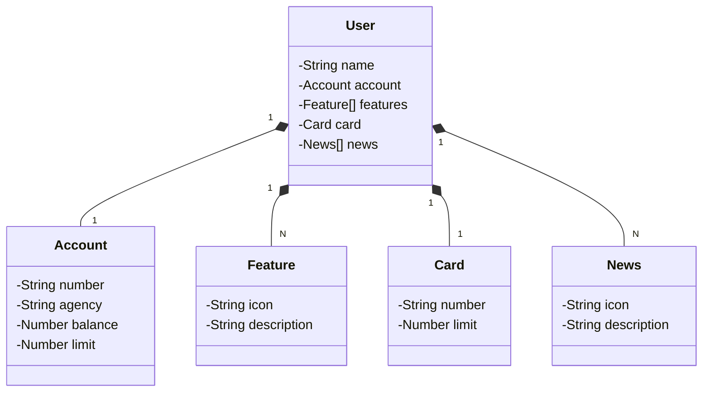

# Santander Dev Week 2023 Java API

## Diagrama de Classes (Domínio da API)

### IMPORTANTE

Aos interessados no desenvolvimento da tela inicial do App do Santander (Figma) em Angular, Android, iOS ou Flutter... Caso a URL produtiva não esteja mais disponível, deixamos um Backup no GitHub Pages, é só dar um GET lá 😘
- URL de Produção: https://sdw-2023-prd.up.railway.app/users/1
- Mock (Backup): https://digitalinnovationone.github.io/santander-dev-week-2023-api/mocks/find_one.json
